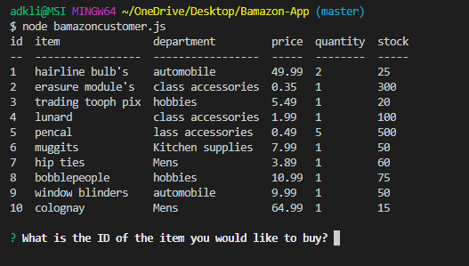
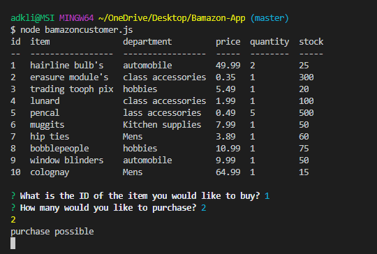

# Bamazon-App

Hello, Welcome to my bamazon-app, a basic application coded by Alojzy to help the user shop for items. To start the app please choose what item you would like to purchase, then choose what quantity of the item you would like. My app will inform you if item/quantity is in stock. If item/quantity are available you may continue with purchase. 

## Bamazon-Item's

A bamazon client that will return item data:
* Item's available
* Department
* Price
* Quantity/Stock

Customer chooses
* Item, then quantity

